# LabelImage
## 목차
0. 설치
1. 라벨명으로 필터링
2. 라벨명 일괄 변경
3. 라벨이 있는 이미지와 라벨만 따로 저장하기

---

## 0. 설치
1. 소스코드 다운로드
```sh
git clone https://LSE-Visions@dev.azure.com/LSE-Visions/MCCB-Vision/_git/lablImg
```
2. 초기 설정
```
(labelImg/폴더/경로) .\install.bat
```
mac의 경우, 아래의 명령어로 pyqt5 설치 필요
```sh
brew install pyqt5
```
3. 실행파일 수정

labelImg.bat
- 실행파일 예시
   ```
   call .\.venv\Scripts\activate.bat # labelImg 를 실행할 본인의 가상환경 실행
   python labelImg.py # labelImg.py 실행
   ```
- 실행파일 예시
  ```
  D:\workplaces\labelImg-master\.venv\Scripts\python.exe labelImg.py # 직접 Python 경로를 입력하여 labelImg.py 실행
  ```

4. 실행파일 바로가기 만들기(optional)
- 만든 후 사용하기 편한 경로(Ex.바탕화면) 에 옮겨 사욯

  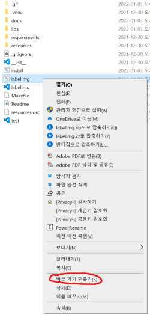

---

## 1. 라벨명으로 필터링
라벨 파일을 읽어, 특정 라벨이 포함된 이미지만 필터링하여 정렬함
1. 필터 위치

    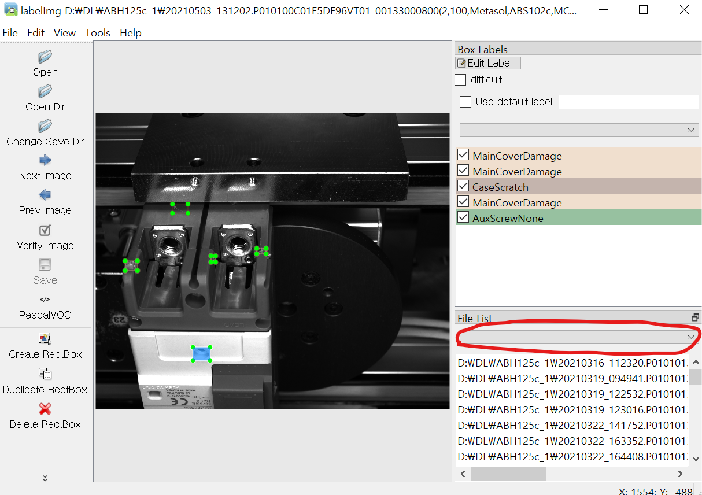

2. 라벨 선택: AuxScrewPoorConnection 라벨 선택

    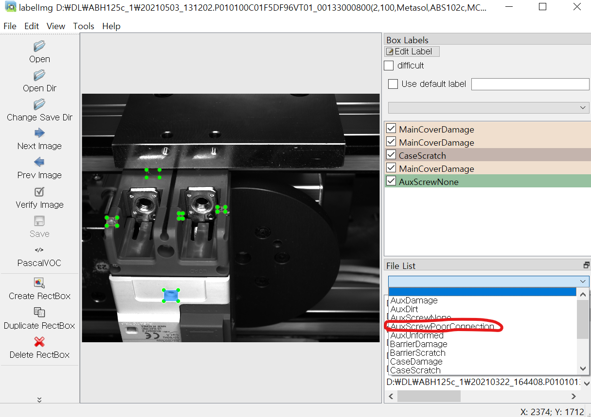

2. 필터링 결과: AuxScrewPoorConnection 라벨이 하나이상 포함된 이미지만 정렬함

    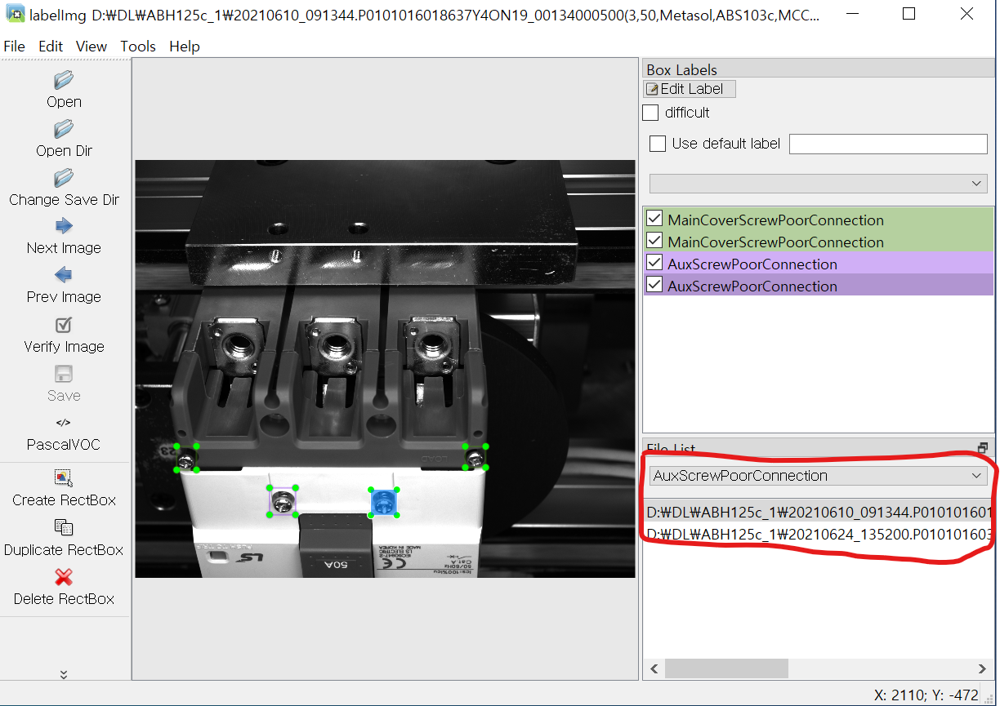

---

## 2. 라벨명 일괄 변경
라벨명을 일괄 변경함
1. 라벨명 변경 기능 위치

    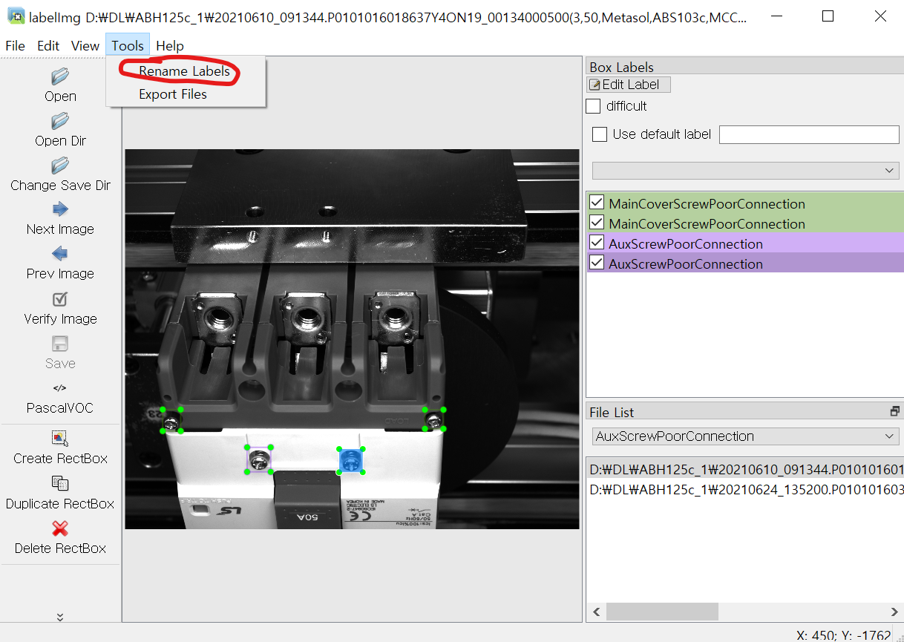

2. 라벨명 입력
    - Search for: 변경 전
    - Replace with: 변경 후

    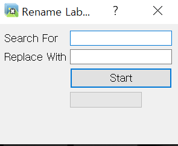

2. 라벨명 변경

    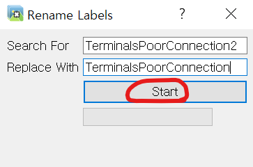
    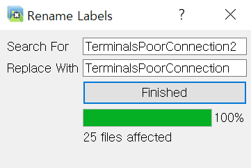

---

## 3. 라벨이 있는 이미지와 라벨만 따로 저장하기
라벨이 있는 이미지와 라벨만 선택하여 지정된 경로에 저장함
1. 라벨,이미지 저장 기능 위치

    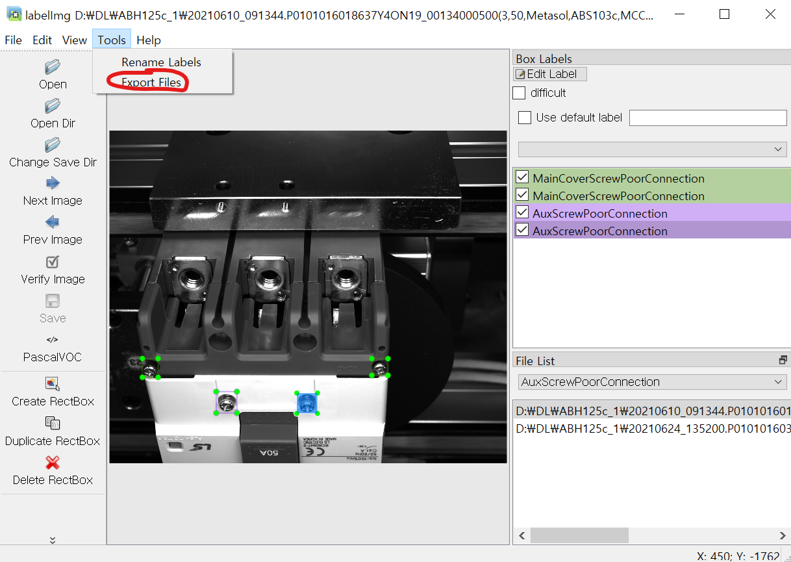

2. 저장 경로 입력

    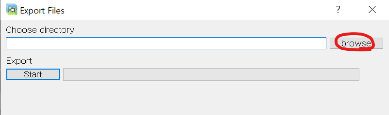

2. 이동

    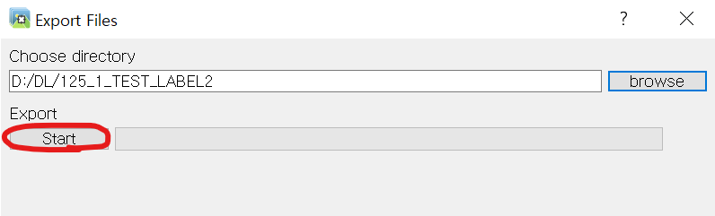
    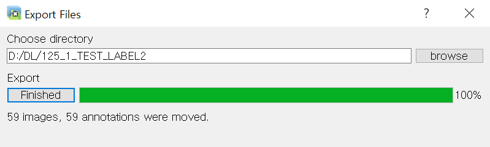

---